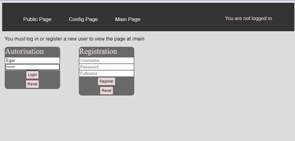
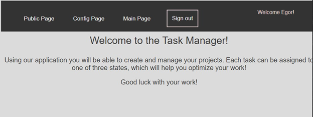
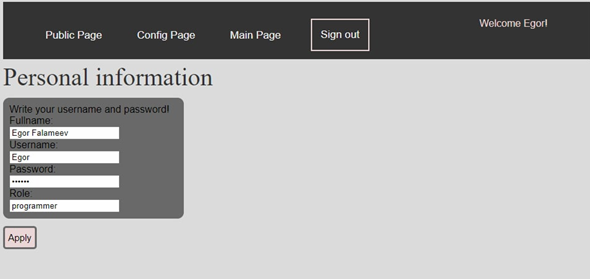
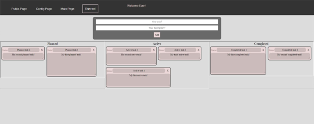

# webpack-frontend
# Project description:

The project is a frontend part of a TODO type web application. After registration, the user can enter tasks for 
subsequent execution with the possibility of changing the status (scheduled, active, completed),
deleting and changing.
Backend is implemented in Django (task-manager) , Frontend is implemented in React.

# Example:

Authorization page: 

Information about this app:

Information about user:

TODO page:

